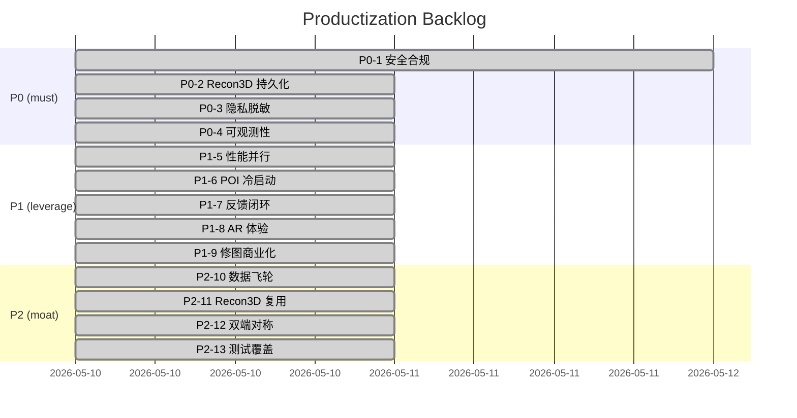

# Productization Backlog (post W1-W11)

> Source: 2026-05-10 review of the just-landed B/C-grade workflows
> (W1-W11). Goal: drive the codebase from "demo green" to "灰度可上线"
> and then to "数据飞轮跑起来"。
>
> **Status legend**: ☐ todo · ◐ in progress · ✅ done · ⏸ blocked
>
> Update this file as items move. Don't delete completed rows — keep the
> history so retros can mine it.

## Priority lanes

| Lane | 含义 | 时间窗 |
|---|---|---|
| **P0 — 阻塞上线** | 安全 / 合规 / 状态一致性问题，不修不能开公测 | 第 1-2 周 |
| **P1 — 体验杠杆** | 改了能直接拉留存 / 转化的功能优化 | 第 3-6 周 |
| **P2 — 长期护城河** | 数据飞轮、双端对称、覆盖率，越早播种越好 | 季度级 |

---

## P0 — Must fix before public beta (Items 1-4)

### P0-1 / 安全与合规（鉴权 + 反刷 + 内容审核） ✅

- ✅ **P0-1.1**  `main.py` 收紧 CORS（`backend/app/main.py` `_resolve_cors_origins()` + `cors_allow_origins` 配置）
- ✅ **P0-1.2**  HMAC `analyze_request_id` token（`backend/app/services/request_token.py`，`/analyze` 在 `debug.analyze_request_id` 里返回，`/feedback` 验证）
- ✅ **P0-1.3**  iOS App Attest stub（`backend/app/services/app_attest.py` + `/devices/attest` 路由 + `enable_app_attest` 开关；当前 shadow-mode，等 iOS 落地后切真校验）
- ✅ **P0-1.4**  应用层 token-bucket rate limit（`backend/app/services/rate_limit.py` + `enable_rate_limit/rate_limit_*_per_min` 配置）；建议生产仍在 nginx 加一层
- ✅ **P0-1.5**  UGC 内容审核（`backend/app/services/content_filter.py`，`feedback._maybe_record_ugc` 调用）
- ✅ **P0-1.6**  device_id 24h dedup（`record_user_spot` 新增 `device_id` + `user_spot_votes` 表）
- ✅ **P0-1.7**  `/recon3d/start` 入参防爆（`recon3d_max_images` / `recon3d_max_image_bytes` / per-device rate limit）
- ✅ **P0-1.8**  `bulk_seed_poi.py` 指数退避 + AMap 限流码识别

**验收**：本地 `pytest` 全绿（259+ 用例），`test_analyze_e2e_scenarios` 验证 `analyze_request_id` 必出。

### P0-2 / Recon3D 状态持久化 ✅

- ✅ **P0-2.1**  `_jobs: dict` → SQLite (`data/recon3d_jobs.db`)；`recon3d.list_jobs/get_job/_persist`
- ✅ **P0-2.2**  `cleanup_loop()` 协程，`main.lifespan` 启动；done 7d / error 1h
- ✅ **P0-2.3**  GeoHash 缓存复用（`MODEL_CACHE_DIR` + `lookup_cached_models`）

### P0-3 / 隐私脱敏 ✅

- ✅ **P0-3.1**  `geo_round_decimals=4`（约 11m 网格）配置；`feedback._round_geo()` 应用
- ✅ **P0-3.2**  `record_user_spot` 同样 round 后写入
- ✅ **P0-3.3**  日志 redactor（`logging_setup._RedactorFilter` 过滤 gps_track / keyframes / api_key / 高精度坐标）
- ✅ **P0-3.4**  `DELETE /feedback/by_device?device_id=...`（GDPR/PIPL 自助删除）
- ✅ **P0-3.5**  iOS Info.plist 隐私文案（`ios/AIPhotoCoach/App/InfoPlistEntries.md` 提供 Xcode 模板）

### P0-5 / 多用户 + 鉴权 + 订阅合规（A0 lane） ◐

> 详见 `docs/MULTI_USER_AUTH.md`。截至 2026-05-11 后端骨架已落，iOS 待 Xcode 集成验证。

- ✅ **A0-1**  `users` 表 + `UserRepo`（`backend/app/services/user_repo.py`）
- ✅ **A0-2**  JWT 签发/校验 + SIWA 验证（`backend/app/services/auth.py`）
- ✅ **A0-3**  `/auth/anonymous` `/auth/siwa` `/auth/refresh` `/auth/logout` `/me`（`backend/app/api/auth.py`）
- ✅ **A0-4**  `current_user` FastAPI 依赖 + 兼容 `X-Device-Id` 兜底（`enable_legacy_device_id_auth`）
- ✅ **A0-5**  `shot_results` / `recon3d_jobs` / `user_spots` 加 `user_id` 列 + 查询过滤；rate-limit key 改为 `user_id`
- ✅ **A0-6**  `DELETE /users/me` 级联删（含跨 db 清理）
- ✅ **A0-7**  `/iap/verify` + `subscriptions` 表 + `/me/entitlements`（`backend/app/api/iap.py` + `services/iap_apple.py`）
- ✅ **A0-8**  `POST /apple/asn` ASN V2 webhook
- ✅ **A0-9**  App Attest 真实验签（CBOR + ECDSA P-256 + 链路 + counter ratchet；缺 root CA 时自动 shadow）
- ✅ **A0-10** iOS `AuthManager`（`ios/AIPhotoCoach/Services/AuthManager.swift`）+ `APIClient` 注入 Bearer
- ✅ **A0-11** iOS `IAPManager` 关 shadow + 上传 JWS + 拉 `/me/entitlements`（10 min TTL 缓存）
- ✅ **A0-12** iOS `AccountView`（SIWA 按钮 + 退出 + 删除账户 + 订阅入口）
- ✅ **A0-13** Privacy Manifest（`ios/AIPhotoCoach/App/PrivacyInfo.xcprivacy`）
- ✅ **A0-14** smoke + e2e 测试（`tests/test_auth_smoke.py` `test_iap_smoke.py` `test_user_isolation_smoke.py`，10 用例）

**验收**：本地 `pytest` **275 用例全绿**（259 已有 + 10 Phase 0 + 6 Phase 1）。iOS 端待 Xcode 编译 + Sandbox 沙箱测购。

### P1-10 / Phase 1 productization（A1 lane） ✅

> 详见 `docs/MULTI_USER_AUTH.md` Phase 1 表 + `docs/PHASE0_DEPLOY_RUNBOOK.md`。

- ✅ **A1-1**  Redis 限流后端（`services/rate_limit.py` Lua token bucket，未设 `REDIS_URL` 回落进程内）
- ✅ **A1-2**  DB 抽象 + 迁移策略（`docs/DATABASE_BACKEND.md`，按表分批切 PG）
- ✅ **A1-4**  匿名账号 30 天 TTL 清理（`main._anonymous_account_sweeper` + `user_repo.purge_inactive_anonymous`）
- ✅ **A1-5**  Pro tier 5× 配额（`rate_limit._scale_for_tier`）
- ✅ **A1-6**  App Store Server API 巡检 cron（`scripts/reconcile_subscriptions.py`，缺 env 自动 noop）
- ✅ **A1-7**  iOS Paywall force-refresh（`IAPManager.paywallGate()`）
- ✅ **A1-8**  iOS 上传前 strip EXIF/GPS（`Core/Privacy/ImageSanitizer.swift`）
- ✅ **A1-9**  启动 env/CA 校验（`services/startup_checks.py`）
- ✅ **A1-10** 隐私政策默认页 + iOS 动态拉取（`web/privacy.html` + `/healthz` + `AccountView`）
- ✅ **P1-10.1** Family Sharing 落地方案（`docs/FAMILY_SHARING.md`）
- ✅ **P1-10.2** Stripe 网页订阅方案（`docs/STRIPE_WEB_SUBSCRIPTION.md`）
- ✅ **P1-10.3** Phase 0 deploy runbook（`docs/PHASE0_DEPLOY_RUNBOOK.md`，逐步可复制命令）

**人工跟进**：
- App Store Connect 创建商品 + 配 ASN V2 webhook URL（见 `docs/MULTI_USER_AUTH.md` deploy checklist）
- 下载 `Apple_App_Attestation_Root_CA.pem` → `backend/app/data/`
- 下载 `AppleRootCA-G3.pem` → `backend/app/data/apple_root_ca_g3.pem`
- prod env 必设：`APP_JWT_SECRET` `APPLE_SIWA_BUNDLE_ID` `APPLE_SIWA_TEAM_ID` `APPLE_IAP_BUNDLE_ID` `CORS_ALLOW_ORIGINS` `REQUEST_TOKEN_SECRET`
- iOS 端：Xcode 加 SIWA capability、App Attest capability、把 `PrivacyInfo.xcprivacy` 拖入工程

### P0-4 / 可观测性 ✅

- ✅ **P0-4.1**  Datadog APM 自动埋点（`enable_ddtrace` 开关 + `main.py` patch_all）
- ✅ **P0-4.2**  Prometheus `/metrics` 端点（`backend/app/api/metrics.py`，counters + summaries）
- ✅ **P0-4.3**  熔断器（`backend/app/services/circuit_breaker.py`，POI lookup 已接入 amap/osm）
- ✅ **P0-4.4**  Dashboard 配置参考：见 `docs/OBSERVABILITY.md`

---

## P1 — Experience leverage (Items 5-9)

### P1-5 / `/analyze` 性能 ✅

- ✅ **P1-5.1**  TaskGroup 并发预取（`analyze_service.run`：weather/POI/indoor/time_optimal/sfm/refs `asyncio.gather`）
- ✅ **P1-5.2**  `style_extract` 走 `asyncio.to_thread`，不堵事件循环
- ✅ **P1-5.3**  `scripts/perf_analyze.py` 微基准

### P1-6 / POI/UGC 冷启动 ✅

- ✅ **P1-6.1**  `_local_user_spots` 动态阈值（数据稀少时 ≥1 vote 即可）
- ✅ **P1-6.2**  `is_curated` 字段；`record_user_spot(is_curated=True)` 让运营预播种
- ✅ **P1-6.3**  `scripts/daily_seed_active_areas.py`（凌晨刷活跃 GPS 网格）
- ✅ **P1-6.4**  Web/iOS 来源 badge（`shot_position_card.js` 补全 poi_ugc/poi_indoor/triangulated/recon3d；iOS 已具）

### P1-7 / 反馈闭环 ✅

- ✅ **P1-7.1**  `POST /feedback/post_process` 端点 + iOS `FeedbackUploader.recordPostProcess()` + Web `postProcessTelemetry()`
- ✅ **P1-7.2**  弱正信号：`FeedbackUploader.recordSilentPositive()`（10 min 后照片仍在 → 隐式 4 星）
- ✅ **P1-7.3**  `time_optimal._rating_from_snapshot` 接受 `silent_positive: true`

### P1-8 / AR 体验 ✅

- ✅ **P1-8.1**  `ShotPositionCard` AR 按钮：`walk_distance_m > 30` 时升主按钮（橙色 prominent）
- ✅ **P1-8.2**  到位音效 + 强成功 haptic（`arriveFraming`：`ARGuideSpeech.speak("到位了")` + notification haptic）
- ✅ **P1-8.3**  GPS 弱信号 banner（`startGpsQualityMonitor` + `weakGpsHint`，accuracy>20m 时常驻）
- ✅ **P1-8.4**  屏幕外 marker 罗盘箭头（`compassArrowDeg` 在 `ARSession.didUpdate` 计算，`compassArrowOverlay` 渲染）

### P1-9 / 修图商业化 ✅

- ✅ **P1-9.1**  `FilterPreset.requiresPro`（cinematic / hkVibe / retroFade / filmWarm）
- ✅ **P1-9.2**  StoreKit 2 wrapper（`ios/AIPhotoCoach/Services/IAPManager.swift`，`useShadowPro=true` 待真商品上架后切换）
- ✅ **P1-9.3**  `PostProcessView` 锁图标 + paywall sheet
- ✅ **P1-9.4**  `meshWarpAvailable` flag 默认隐藏瘦脸/大眼（直到 Vision face-mesh warp 实装），保留亮眼 / 美白 / 磨皮

---

## P2 — Long-term moat (Items 10-13)

### P2-10 / 数据飞轮 ✅

- ✅ **P2-10.1**  `scripts/weekly_poi_boost.py`（POI conversion 写回 `pois.boost`）+ `_local()` 排序时减权
- ✅ **P2-10.2**  `scripts/weekly_style_cluster.py`（参考图风格聚类 → `data/style_centroids.json`）
- ✅ **P2-10.3**  AR 漏斗事件（`POST /feedback/ar_nav` + iOS `recordArNav("arrived")` 在 `arriveFraming` 触发）

### P2-11 / Recon3D 复用 ✅

- ✅ **P2-11.1**  GeoHash 缓存（`recon3d._maybe_cache_model` + `MODEL_CACHE_DIR/<gh>/<job_id>.json`）
- ✅ **P2-11.2**  Triangulation prior（`triangulation.derive_far_points_with_prior`：cached SparseModel bbox 内点 confidence +0.15）
- ✅ **P2-11.3**  数据集导出（`scripts/export_recon3d_dataset.py` → `data/recon3d_dataset.jsonl`）

### P2-12 / iOS/Web 双端对称 ✅

- ✅ **P2-12.1**  iOS `WalkSegment.gpsTrack` 字段
- ✅ **P2-12.2**  iOS `WalkSegment.keyframesB64` 字段（`WalkKeyframe`）
- ✅ **P2-12.3**  契约测试 `tests/test_contract_ios_walk_segment.py`

### P2-13 / 测试覆盖 ✅

- ✅ **P2-13.1**  E2E `tests/test_analyze_e2e_scenarios.py`（portrait_basic / scenery_geo / light_shadow + metrics + delete）
- ✅ **P2-13.2**  Smoke 单测：rate_limit / circuit_breaker / content_filter / request_token / recon3d_persistence
- ✅ **P2-13.3**  iOS snapshot stub `ios/AIPhotoCoach/Tests/PostProcessSnapshotTests.swift`（待 swift-snapshot-testing 入库后启用）
- ✅ **P2-13.4**  Web Playwright smoke `scripts/smoke_web_landing.mjs`

---

## Suggested execution rhythm

## Tracking rules

1. 每完成一个 sub-task 把 `☐` 改成 `✅` 并附上提交 SHA。
2. P0 任意一项 ⏸ 阻塞 ≥2d，立刻拉群同步。
3. 每周一晨会扫一眼这文档，未推进的 P1 自动降级（不打折就降优先级，避免无意义的「待办」积压）。

---

## 后续仍需人工跟进的事项（不在代码内）

- App Store Connect 上架 `ai_photo_coach.pro.monthly` 自动续订订阅；登记后将 `IAPManager.useShadowPro` 设为 `false`。
- Apple Developer 后台开启 App Attest 能力 + 下载 Apple App Attest Root CA → 放到 `backend/app/data/apple_app_attest_root_ca.pem`；放好后 `app_attest.is_enforcing()` 自动转 true。
- nginx / Caddy / Cloudflare 边缘 rate limit（应用层 bucket 只是兜底）：参考 `docs/OBSERVABILITY.md` 的样例配置。
- Datadog dashboard：从 `/metrics` 抓取 → 见 `docs/OBSERVABILITY.md` 提供的 dashboard JSON 模板。
- 给 PostProcessView 接入真正的 Vision face-mesh warp（瘦脸 / 大眼），完成后把 `UserDefaults.bool("ai_photo.beauty.meshWarp")` 默认改 true。
- 配 cron：
  - `0 3 * * *` `python -m scripts.daily_seed_active_areas`
  - `0 4 * * 0` `python -m scripts.weekly_poi_boost --days 14`
  - `0 5 * * 0` `python -m scripts.weekly_style_cluster`
  - `0 6 1 * *` `python -m scripts.export_recon3d_dataset`
